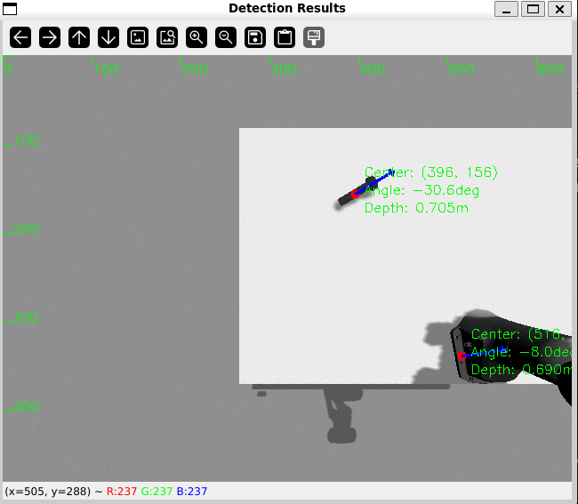
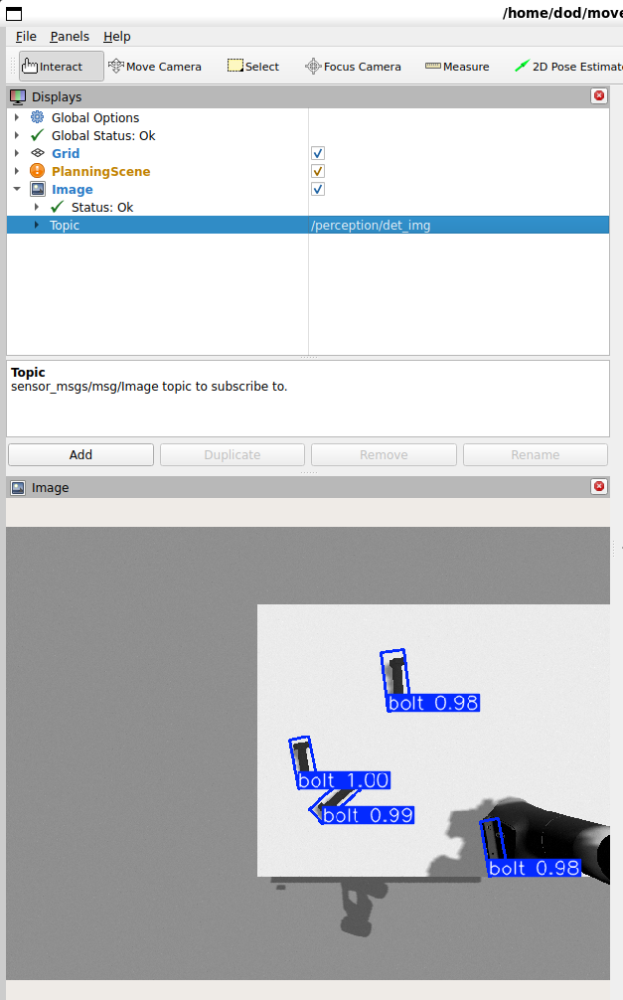
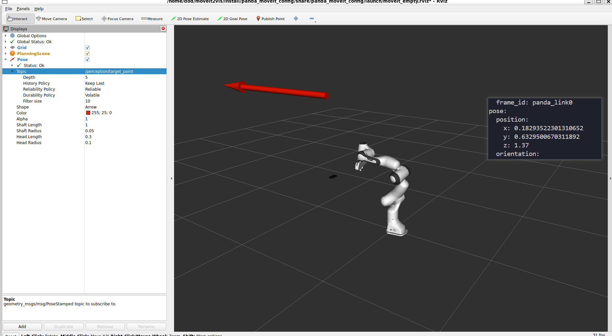
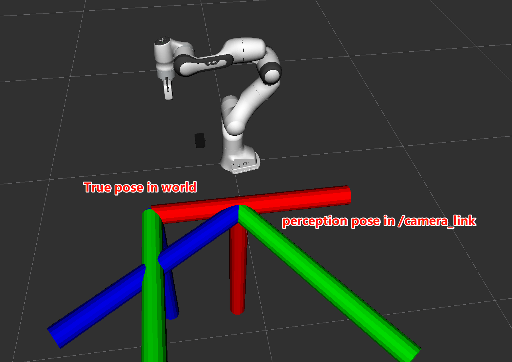
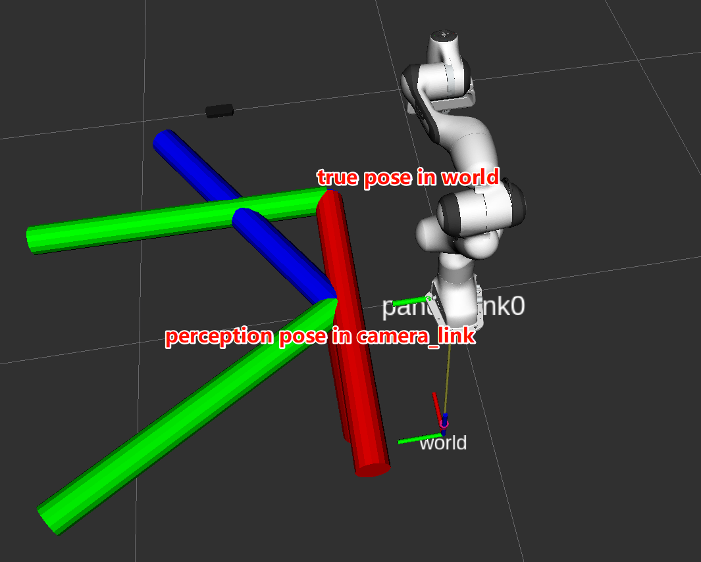
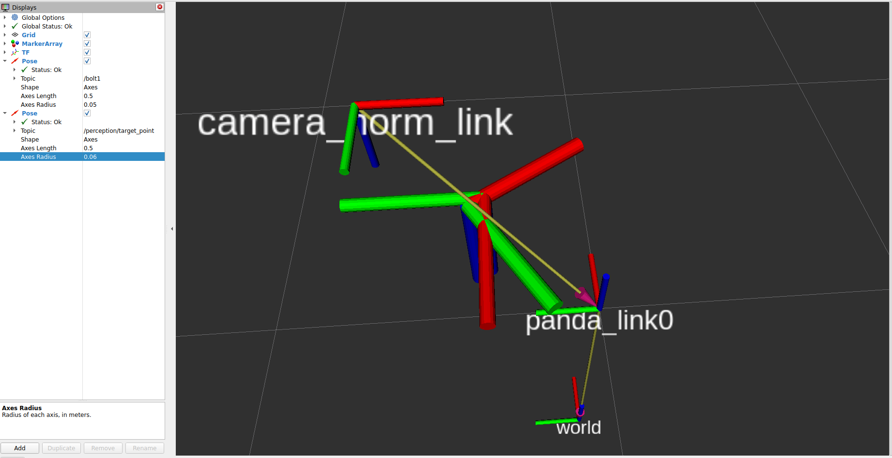
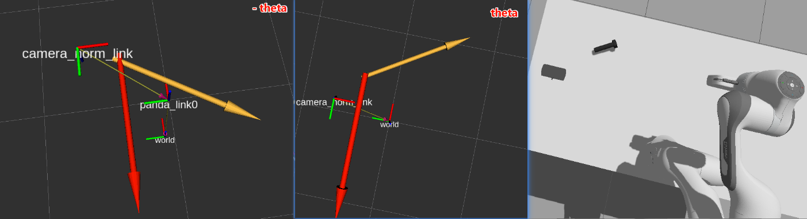
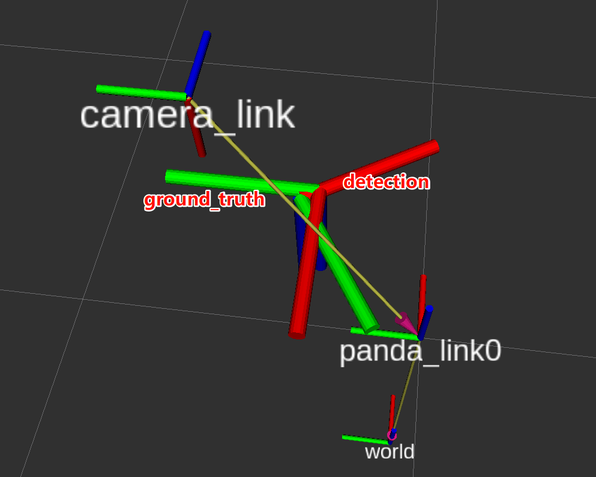
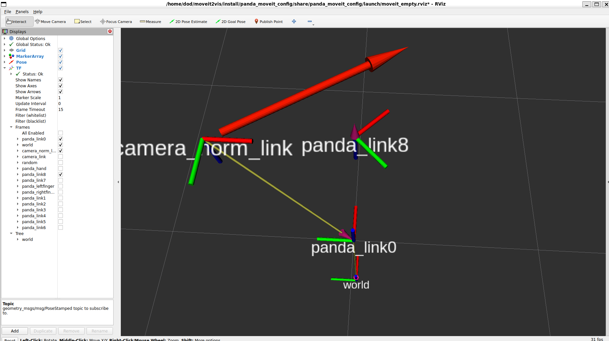

# Moveit2Vis

## 1. panda_moveit_config

可以通过`moveit setup assistant`工具构建，这里以[panda_moveit_config](https://github.com/moveit/moveit_resources)为例。

（1）时钟同步问题：当 [use_sim_time](vscode-file://vscode-app/c:/Program Files/Microsoft VS Code/resources/app/out/vs/code/electron-sandbox/workbench/workbench.html) 设置为 True 时，ROS 2 节点会等待外部时间源（如 Gazebo）提供系统时间，而不是使用系统时钟。如果你不是在 Gazebo 等仿真环境中运行，应将 [use_sim_time](vscode-file://vscode-app/c:/Program Files/Microsoft VS Code/resources/app/out/vs/code/electron-sandbox/workbench/workbench.html) 设置为 False。如果需要使用仿真时间，确保有节点（如 Gazebo）发布 `/clock` 话题。（这可能导致`controller_manager` 还未完全初始化）

（2）偶现性某个controller启动失败，手动重启可以解决。

```bash
dod@qDoDp:~$ ros2 control list_controllers
[INFO] [1748417846.269808267] [_ros2cli_109118]: waiting for service /controller_manager/list_controllers to become available...
joint_state_broadcaster joint_state_broadcaster/JointStateBroadcaster          active  
panda_hand_controller   position_controllers/GripperActionController           active  
panda_arm_controller    joint_trajectory_controller/JointTrajectoryController  inactive
dod@qDoDp:~$ ros2 control switch_controllers --activate panda_arm_controller
[INFO] [1748418028.078421922] [_ros2cli_112076]: waiting for service /controller_manager/switch_controller to become available...
Successfully switched controllers!
Activated controllers: [ panda_arm_controller ]
dod@qDoDp:~$ ros2 control list_controllers
[INFO] [1748418035.993363357] [_ros2cli_112234]: waiting for service /controller_manager/list_controllers to become available...
joint_state_broadcaster joint_state_broadcaster/JointStateBroadcaster          active
panda_hand_controller   position_controllers/GripperActionController           active
panda_arm_controller    joint_trajectory_controller/JointTrajectoryController  active
```


### MoveItConfigsBuilder

第一种写法：使用 `planning_scene_monitor()` 明确配置

```python
moveit_config = (
    MoveItConfigsBuilder("panda")
    .robot_description(file_path="config/panda_gz.urdf.xacro")
    .robot_description_semantic(file_path="config/panda.srdf")
    .planning_scene_monitor(
        publish_robot_description=True, 
        publish_robot_description_semantic=True
    )
    ...
    .to_moveit_configs()
)

```

- `planning_scene_monitor()` 是 MoveIt 2 的一个 helper 方法，它会自动生成与 planning scene 相关的参数（尤其是 launch 中使用 `move_group` 时）。
- 它通常在你用 `move_group` + `moveit_config.launch_description()` 启动全套系统时非常可靠。
- 它会把 `robot_description` 等参数发布出去，供其他节点（如 RViz）订阅。
- 它生成的是 **默认规划场景配置**，不能覆盖太多定制设置（如多个 planning_pipeline 的 request 配置）。
- 如果你的控制器、多个 pipeline 配置较复杂，就比较容易出错，或冲突。

第二种写法：通过 `moveit_cpp()` 使用 YAML

```python
moveit_config = (
    MoveItConfigsBuilder("panda")
    .robot_description(file_path="config/panda_gz.urdf.xacro")
    .robot_description_semantic(file_path="config/panda.srdf")
    ...
    .moveit_cpp("config/controller_setting.yaml")
    .to_moveit_configs()
)

```

- `moveit_cpp()` 是为使用 `moveit_cpp`（C++ API 启动）设计的，**更加灵活**。
- 可以定义多个 pipeline 的 planner 配置、planning_scene_monitor 的订阅 topic、自定义 timeout、默认使用哪一个 pipeline，**功能更细致**。
- 尤其适合你自己管理 `planning_scene_monitor` 或写自定义节点时使用（比如 perception-grasping pipeline）。

| 写法                        | 优势                      | 适用场景                        | 注意事项                    |
| --------------------------- | ------------------------- | ------------------------------- | --------------------------- |
| `.planning_scene_monitor()` | 默认发布场景、适配 launch | 调用 move_group + RViz 启动调试 | 不支持高级 planner 组合配置 |
| `.moveit_cpp(yaml)`         | 支持多 pipeline、复杂配置 | 自定义抓取 node、感知融合       | 注意不要和 move_group 冲突  |

不要同时调用 `planning_scene_monitor()` 和 `.moveit_cpp()`，它们会冲突。

## 2. panda_gz

```bash
# create
ros2 pkg create --build-type ament_cmake panda_gz
```

需要配置gz_ros2_control，见`panda_moveit_config/config/panda.urdf.xacro`，`panda_moveit_config/config/panda.gz_ros2_control.xacro`。

主要是启动gz sim仿真，同时启动panda_moveit_config。

```bash
ros2 launch panda_gz gz.launch.py
```

## gazebo中机械臂倾倒问题记录

首先在rviz中对比验证：


通过`MoveItConfigsBuilder`加载moveit_config，其中

```python
moveit_config = (
        MoveItConfigsBuilder("panda")
        .robot_description(
            file_path="config/panda_gz.urdf.xacro",
        )
```

使用`panda.urdf.xacro`，moveit config启动没有问题，motion planning正常规划执行。

（补充测试：初始位姿正常加载）

```xml
<?xml version="1.0"?>
<robot xmlns:xacro="http://www.ros.org/wiki/xacro" name="panda">
    <xacro:arg name="initial_positions_file" default="initial_positions.yaml" />
    <xacro:arg name="ros2_control_hardware_type" default="mock_components" />
    <xacro:property name="PI" value="3.14159274"/>

    <!-- Import panda urdf file -->
    <xacro:include filename="$(find panda_description)/urdf/panda.urdf.xacro" />

    <!-- Import camera urdf file -->
    <xacro:include filename="$(find panda_description)/urdf/camera/camera.xacro"/>

    <!-- Import panda ros2_control description -->
    <xacro:include filename="panda.ros2_control.xacro" />
    <xacro:include filename="panda_hand.ros2_control.xacro" />

    <xacro:panda_ros2_control name="PandaFakeSystem" initial_positions_file="$(arg initial_positions_file)" ros2_control_hardware_type="$(arg ros2_control_hardware_type)"/>
    <xacro:panda_hand_ros2_control name="PandaHandFakeSystem" ros2_control_hardware_type="$(arg ros2_control_hardware_type)"/>

    <!-- Camera -->
    <xacro:camera_v0 parent="panda_link7">
	    <origin xyz="0.0 0.0 0.0" rpy="0 ${PI/2} 0"/>
    </xacro:camera_v0>
    <xacro:camera_gazebo_v0/>
</robot>

```

使用`panda_gz.urdf.xacro`，moveit config启动报错，motion planning 规划失败。

（补充测试：初始位姿没有正常加载）

```xml
<?xml version="1.0"?>
<robot xmlns:xacro="http://www.ros.org/wiki/xacro" name="panda">
    <xacro:arg name="initial_positions_file" default="initial_positions.yaml" />
    <xacro:arg name="ros2_control_hardware_type" default="mock_components" />
    <xacro:property name="PI" value="3.14159274"/>

    <!-- Import panda urdf file -->
    <xacro:include filename="$(find panda_description)/urdf/panda.urdf" />

    <!-- Import camera urdf file -->
    <xacro:include filename="$(find panda_description)/urdf/camera/camera.xacro"/>

    <!-- Camera -->
    <xacro:camera_v0 parent="panda_link0">
	    <origin xyz="0.2 0.6 0.7" rpy="0 ${PI/2} 0"/>
    </xacro:camera_v0>
    <xacro:camera_gazebo_v0/>

    <!-- controllers for gazebo -->
    <xacro:include filename="panda.gz_ros2_control.xacro" />
    <xacro:panda_gazebo_ros2_control initial_positions_file="$(arg initial_positions_file)"/>

    <!-- There were no gazebo files in the original file -->
    <gazebo>
        <plugin
            filename="gz_ros2_control-system"
            name="gz_ros2_control::GazeboSimROS2ControlPlugin">
            <parameters>$(find panda_moveit_config)/config/ros2_controllers.yaml</parameters>
        </plugin>
        <plugin
            filename="gz-sim-joint-state-publisher-system"
            name="gz::sim::systems::JointStatePublisher">
        </plugin>
        <plugin
            filename="gz-sim-pose-publisher-system"
            name="gz::sim::systems::PosePublisher">
            <publish_link_pose>true</publish_link_pose>
            <use_pose_vector_msg>true</use_pose_vector_msg>
            <publish_nested_model_pose>true</publish_nested_model_pose>
        </plugin>

        <plugin filename="ignition-gazebo-sensors-system" name="ignition::gazebo::systems::Sensors">
        <render_engine>ogre2</render_engine>
        </plugin>
    </gazebo>
</robot>

```

报错信息：

```bash
[rviz2-1] [ERROR] [1749090514.328266746] [rviz2.moveit.ros.motion_planning_frame]: Action server: /recognize_objects not available
[rviz2-1] [INFO] [1749090514.361263046] [rviz2.moveit.ros.motion_planning_frame]: MoveGroup namespace changed: / -> . Reloading params.

[ros2_control_node-5] [WARN] [1749090517.891577965] [controller_manager]: Waiting for data on 'robot_description' topic to finish initialization
[move_group-4] [INFO] [1749090518.048353266] [move_group.moveit.moveit.ros.move_group.move_action]: MoveGroupMoveAction: Received request
[rviz2-1] [INFO] [1749090518.048700666] [rviz2.moveit.ros.move_group_interface]: Plan and Execute request accepted
[move_group-4] [INFO] [1749090518.048824366] [move_group.moveit.moveit.ros.move_group.move_action]: executing..
[spawner-7] [WARN] [1749090518.440929868] [spawner_panda_hand_controller]: Could not contact service /controller_manager/list_controllers
[spawner-7] [INFO] [1749090518.441308768] [spawner_panda_hand_controller]: waiting for service /controller_manager/list_controllers to become available...
[ros2_control_node-5] [WARN] [1749090518.891419170] [controller_manager]: Waiting for data on 'robot_description' topic to finish initialization
[move_group-4] [INFO] [1749090519.049204569] [move_group.moveit.moveit.ros.current_state_monitor]: Didn't receive robot state (joint angles) with recent timestamp within 1.000000 seconds. Requested time 1749090518.049098, but latest received state has time 0.000000.
[move_group-4] Check clock synchronization if your are running ROS across multiple machines!
[move_group-4] [WARN] [1749090519.049321569] [move_group.moveit.moveit.ros.planning_scene_monitor]: Failed to fetch current robot state.
[move_group-4] [INFO] [1749090519.049409469] [move_group.moveit.moveit.ros.move_group.move_action]: Combined planning and execution request received for MoveGroup action. Forwarding to planning and execution pipeline.
[move_group-4] [INFO] [1749090519.049544769] [move_group.moveit.moveit.ros.plan_execution]: Planning attempt 1 of at most 1
[move_group-4] [INFO] [1749090519.049645669] [move_group.moveit.moveit.ros.move_group.capability]: Using planning pipeline 'ompl'
[move_group-4] [INFO] [1749090519.049943669] [move_group]: Calling PlanningRequestAdapter 'ResolveConstraintFrames'
[move_group-4] [INFO] [1749090519.050012569] [move_group]: Calling PlanningRequestAdapter 'ValidateWorkspaceBounds'
[move_group-4] [INFO] [1749090519.050043469] [move_group]: Calling PlanningRequestAdapter 'CheckStartStateBounds'
[move_group-4] [INFO] [1749090519.050073769] [move_group]: Calling PlanningRequestAdapter 'CheckStartStateCollision'
[move_group-4] [ERROR] [1749090519.050284669] [move_group]: PlanningRequestAdapter 'CheckStartStateCollision' failed, because '2 contact(s) detected : panda_hand - panda_link5, panda_link5 - panda_link7, '. Aborting planning pipeline.
[move_group-4] [INFO] [1749090519.050356369] [move_group.moveit.moveit.ros.move_group.move_action]: START_STATE_IN_COLLISION
[rviz2-1] [INFO] [1749090519.051052369] [rviz2.moveit.ros.move_group_interface]: Plan and Execute request aborted
[rviz2-1] [ERROR] [1749090519.051973669] [rviz2.moveit.ros.move_group_interface]: MoveGroupInterface::move() failed or timeout reached
```

### 对比总结

如果在gz.launch.py中调用moveit_config.launch.py同时启动了ros2_control_node，会出现警告信息：

```bash
[ros2_control_node]: Waiting for data on 'robot_description' topic to finish initialization

```

ros2_control_node和gz_ros2_control冲突，这两个系统都试图管理 **同一个机器人控制链路和 joint 状态**，结果是：**话题冲突 / 参数冲突 / 控制器管理冲突**。

## 感知模块

### 1、定义感知接口

在ROS 2中，消息、服务和动作统称为`接口（interfaces）`

- `msg/*.msg`
- `src/*.srv`
- `action/*.action`

```bash
ros2 pkg create --build-type ament_cmake perception_interfaces
```

参考：[ros-perception/vision_msgs](https://github.com/ros-perception/vision_msgs)

要将您定义的接口转换为特定语言的代码（如C++和Python），以便在这些语言中使用它们，请将以下行添加到 `CMakeLists.txt` 中：

```cmake
find_package(geometry_msgs REQUIRED)
find_package(rosidl_default_generators REQUIRED)

rosidl_generate_interfaces(${PROJECT_NAME}
  "msg/Num.msg"
  "msg/Sphere.msg"
  "srv/AddThreeInts.srv"
  DEPENDENCIES geometry_msgs # Add packages that above messages depend on, in this case geometry_msgs for Sphere.msg
)
```

因为接口依赖于rosidl_default_generators来生成特定语言的代码，所以您需要在其上声明构建工具依赖项。rosidl_default_runtime是一个运行时或执行阶段的依赖项，以便稍后能够使用这些接口。rosidl_interface_packages是您的软件包“tutorial_interfaces”应关联的依赖组的名称，使用`<member_of_group>`标签声明。

将以下行添加到`package.xml`的`<package>`元素中：

```xml
<depend>geometry_msgs</depend>
<buildtool_depend>rosidl_default_generators</buildtool_depend>
<exec_depend>rosidl_default_runtime</exec_depend>
<member_of_group>rosidl_interface_packages</member_of_group>
```


现在，你可以通过使用 `ros2 interface show` 命令确认接口创建是否成功：

```bash
dod@qDoDp:~/moveit2vis$ ros2 interface show perception_interfaces/msg/Detection2DWithDepth
Detection2D detection
        #
        std_msgs/Header header
                builtin_interfaces/Time stamp
                        int32 sec
                        uint32 nanosec
                string frame_id
        ObjectHypothesisWithPose[] results
                ObjectHypothesis hypothesis
                        string class_id # 类别（例如"bolt"）
                        float64 score	# 置信度/匹配分数
                geometry_msgs/PoseWithCovariance pose # 目标的6D姿态+不确定性
                        Pose pose
                                Point position
                                        float64 x
                                        float64 y
                                        float64 z
                                Quaternion orientation
                                        float64 x 0
                                        float64 y 0
                                        float64 z 0
                                        float64 w 1
                        float64[36] covariance
        BoundingBox2D bbox
                Pose2D center
                        Point2D position
                                float64 x
                                float64 y
                        float64 theta
                float64 size_x
                float64 size_y
        string id

# 目标区域的深度统计信息
float64 depth_center
# float64 depth_min
# float64 depth_max
```


### 2、yolov8_obb

```bash
ros2 pkg create --build-type ament_python yolov8_obb
```

#### pkg 配置

主要配置`setup.py`

- `data_files`: 安装资源文件（launch、模型、package.xml 等）

- `entry_points`: 配置 Python 脚本为可执行节点

```python
from setuptools import find_packages, setup
import os 
from glob import glob

package_name = 'yolov8_obb'

setup(
    name=package_name,
    version='0.0.0',
    packages=find_packages(exclude=['test']),
    data_files=[
        ('share/ament_index/resource_index/packages',
            ['resource/' + package_name]),
        ('share/' + package_name, ['package.xml']),
        # 安装launch文件
        (os.path.join('share', package_name, 'launch'), glob('launch/*.launch.py')),
        # 安装ckpt文件
        (os.path.join('share', package_name, 'ckpt'), glob('ckpt/*.pt')),
    ],
    install_requires=['setuptools'],
    zip_safe=True,
    maintainer='dod',
    maintainer_email='319377758@qq.com',
    description='TODO: Package description',
    license='TODO: License declaration',
    tests_require=['pytest'],
    entry_points={
        'console_scripts': [
            'bolt_det_pub = yolov8_obb.bolt_det_pub:main',
        ],
    },
)

```

ROS 2 使用 `ament` 构建系统，但对于 **`ament_python` 类型的包**：`package.xml` 只在构建和部署层面声明依赖，不影响 Python 脚本的运行时导入行为。那么 即使 `package.xml` 中不写 `<depend>perception_interfaces</depend>`，也不会报错。

#### /perception/det_2d_d & /perception/det_img

感知代码关于`ultralytics.engine.results.OBB`对象的调试日志：

```python
Box type: <class 'ultralytics.engine.results.OBB'>
Box attributes: ['__class__', 
'__delattr__', '__dict__', '__dir__', '__doc__', '__eq__', '__format__', '__ge__', '__getattr__', 
'__getattribute__', '__getitem__', '__getstate__', '__gt__', '__hash__', '__init__', '__init_subclass__', 
'__le__', '__len__', '__lt__', '__module__', '__ne__', '__new__', '__reduce__', '__reduce_ex__', 
'__repr__', '__setattr__', '__sizeof__', '__str__', '__subclasshook__', '__weakref__', 'cls', 
'conf', 'cpu', 'cuda', 'data', 'id', 'is_track', 'numpy', 'orig_shape', 'shape', 
'to', 'xywhr', 'xyxy', 'xyxyxyxy', 'xyxyxyxyn']

self.get_logger().info(f"Box type: {type(box)}")
# 输出box的属性列表
self.get_logger().info(f"Box attributes: {dir(box)}")

# 分析关键属性
box_cls = box.cls
Box class (box_cls): tensor([0.], device='cuda:0'), type: <class 'torch.Tensor'>
self.get_logger().info(f"Box class (box_cls): {box_cls}, type: {type(box_cls)}")

if hasattr(box, 'conf'):
    Box confidence: tensor([0.9951], device='cuda:0'), type: <class 'torch.Tensor'>
    self.get_logger().info(f"Box confidence: {box.conf}, type: {type(box.conf)}")

# 输出xyxyxyxy的形状和类型
Box xyxyxyxy type: <class 'torch.Tensor'>
Box xyxyxyxy shape: torch.Size([1, 4, 2])
self.get_logger().info(f"Box xyxyxyxy type: {type(box.xyxyxyxy)}")
self.get_logger().info(f"Box xyxyxyxy shape: {box.xyxyxyxy.shape if hasattr(box.xyxyxyxy, 'shape') else 'N/A'}")

# 如果有model.names，输出类别名称
if hasattr(self.model, 'names') and int(box_cls) in self.model.names:
    Class name: bolt
    self.get_logger().info(f"Class name: {self.model.names[int(box_cls)]}")
```

创建`yolov8_obb/yolov8_obb/bolt_det_pub.py`，主要改进：

- 通过`get_package_share_directory`使用相对路径加载模型，避免写死
- 适配新的消息类型并发布
- 返回中心坐标的方向角信息，对于后续的位姿计算非常有效

测试：

```bash
# 运行测试代码
python3 src/yolov8_obb/test/test_bolt_det_pub.py

# 启动bolt_det_pub
ros2 launch yolov8_obb bolt_det_pub.launch.py
```

方向角计算：

- 坐标系定义：使用的是图像坐标系，其中x轴向右，y轴向下
- 参考方向：角度是相对于x轴正方向（水平向右）计算的
- 旋转方向：使用np.arctan2(dy, dx)计算，遵循数学中的标准定义，即从x轴正方向逆时针旋转为正角度





#### /perception/target_point

计算target_point偏差较大。

其中一个原因：moveit_config启动时panda_link0相对world是0偏移，而gz sim启动时机械臂生成有个初始位置（为了放在平台上），因此需要启动moveit_config的时候tf指定坐标偏移。



1、像素坐标：

`ultralytics` 的 `YOLO` 模型在进行图像目标检测时，输出的坐标（如边界框 `x`, `y`）是**基于图像的像素坐标系**，其原点在左上角(0,0)。

通过目标检测得到目标物体的中心点像素坐标。

2、方向角：


2、计算/camera_link下的坐标：

已知相机内参，利用像素坐标计算相机坐标（默认以XY轴作为相机平面）。


3、相机实际坐标系存在旋转：

比如：

```xml
<!-- Camera -->
<xacro:camera_v0 parent="panda_link0">
    <origin xyz="0.2 0.6 0.7" rpy="0 ${PI/2} 0"/>
</xacro:camera_v0>
```

因此需要利用tf工具，根据roll,pitch,yaw参数对计算得出的坐标进行转换。

最终得到实际/camera_link下的坐标。

#### 测试记录

手动发布`bolt1`位姿信息，便于在rviz2中可视化调试。

~~利用ros_gz_bridge获取`bolt1`位姿信息，便于在rviz2中调试。~~

```bash
ros2 topic pub /bolt1 geometry_msgs/PoseStamped "{
  header: {
    frame_id: 'world'
  },
  pose: {
    position: {x: 0.5, y: 0.35, z: 1.05},
    orientation: {x: 0.0, y: 1.5, z: 0.0, w: 0.0}
  }
}"


ros2 topic pub /bolt1 geometry_msgs/PoseStamped "{
  header: {
    frame_id: 'panda_link0'
  },
  pose: {
    position: {x: 0.5, y: 0.35, z: 0.50},
    orientation: {x: 0.0, y: 0.0, z: 0.0, w: 1.0}
  }
}"
```





过程简化，构建一个标准相机坐标系，根据2d像素坐标推算标准相机坐标系下的位姿。

```python
static_tf_node2 = Node(
        package="tf2_ros",
        executable="static_transform_publisher",
        name="static_transform_publisher",
        output="log",
        arguments=["0.2", "0.6", "0.7", # position
                   "-1.5708", "0.0", "3.1416", # yaw, pitch, row
                   "panda_link0", # parent frame
                   "camera_norm_link"], # child frame
        parameters=[{"use_sim_time": use_sim_time}],
    )
```





调试成功，`/perception/target_point`发布目标物体在`/panda_link0`下的位姿，与真实位姿基本吻合。




对于抓取任务，通常需要让机器人末端执行器的方向垂直于物体平面，因此考虑针对末端执行器的坐标系进行位姿计算。

**tf_transformations**

```bash
sudo apt-get install ros-jazzy-tf-transformations
```

我们更容易以轴旋转的方式思考，但很难用四元数来思考。一个建议是首先按照滚转（绕X轴）、俯仰（绕Y轴）和偏航（绕Z轴）计算目标旋转，然后再将其转换为四元数。

```python
q = quaternion_from_euler(1.5707, 0, -1.5707)
print(f'The quaternion representation is x: {q[0]} y: {q[1]} z: {q[2]} w: {q[3]}.')
```

要将一个四元数的旋转应用于姿势，只需将姿势的先前四元数乘以表示所需旋转的四元数。此乘法的顺序很重要。

```python
q_orig = quaternion_from_euler(0, 0, 0)
# Rotate the previous pose by 180* about X
q_rot = quaternion_from_euler(3.14159, 0, 0)
q_new = quaternion_multiply(q_rot, q_orig)
```


## 抓取demo

```bash
ros2 pkg create --build-type ament_python moveit2grasp
```

```bashh
ros2 topic pub /demo_pose geometry_msgs/PoseStamped "{
  header: {
    frame_id: 'camera_link'
  },
  pose: {
    position: {x: -0.018, y: 0.033, z: 0.670},
    orientation: {x: 0.0, y: 0.0, z: 0.0, w: 1.0}
  }
}"


ros2 topic pub /perception/target_point geometry_msgs/PoseStamped "{
  header: {
    frame_id: 'panda_link0'
  },
  pose: {
    position: {x: 0.25, y: 0.63, z: 1.04},
    orientation: {x: 0.01, y: -1.50, z: -2.85, w: 0.0}
  }
}"

ros2 topic pub /bolt1 geometry_msgs/PoseStamped "{
  header: {
    frame_id: 'world'
  },
  pose: {
    position: {x: 0.5, y: 0.35, z: 1.05},
    orientation: {x: 0.0, y: 1.5, z: 0.0, w: 0.0}
  }
}"
```

## 方向角

计算`/target_pose`时通常发布在`/panda_link0`机械臂基座坐标系下（静态），考虑转换到`/panda_link8`末端执行器坐标系下会出现tf消息不完整等错误。

希望利用方向角来绕z轴旋转指定角度（考虑末端执行器的初始偏转角度），同时要注意末端执行器反转z轴（绕x轴180度实现），最终对应变换代码如下：

```python
# 修改：对于Z轴方向相反的情况，需要将角度取反，并且调整欧拉角
# 在基座坐标系下，Z轴指向上，而在末端执行器坐标系下，Z轴指向下
# 添加PI旋转将使orientation正确面向目标
q = quaternion_from_euler(math.pi, 0, -theta+0.3825)  # 注意角度取反，并添加X轴上的180度旋转
target_pose.pose.orientation.x = q[0]
target_pose.pose.orientation.y = q[1]
target_pose.pose.orientation.z = q[2]
target_pose.pose.orientation.w = q[3]
```

